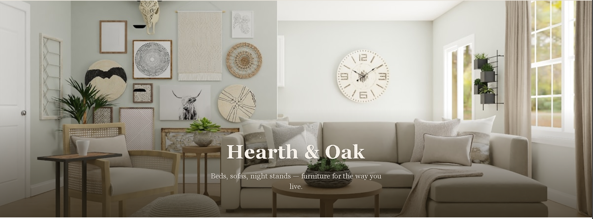
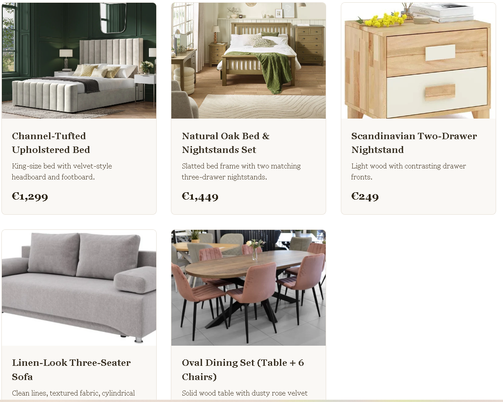
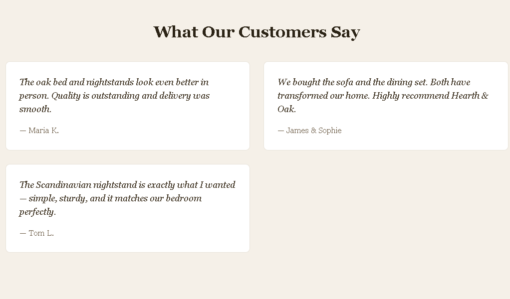
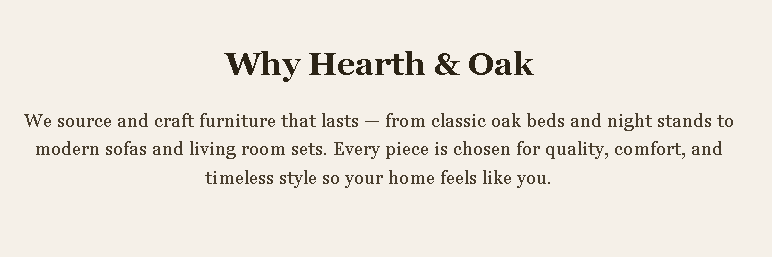
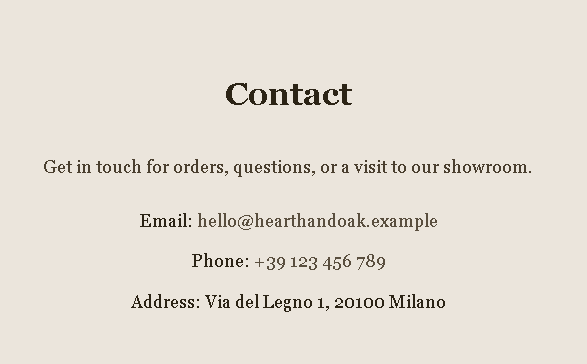

# Hearth & Oak — Landing Page

This landing page is for a relative of mine who plans to open an online furniture store. It showcases the brand **Hearth & Oak** and presents beds, night stands, sofas, and dining furniture with a clean, welcoming layout. The site is built with vanilla HTML and CSS (no frameworks) 

**Live demo:** https://d3adeye69.github.io/tum-web-lab2/

---

## Introduction

The page is a one-page site for a family member’s future online furniture business. It includes navigation, a hero, product collection with prices, reviews, a short “about” block, and contact details. All content and styling are kept simple and easy to update.

---

## Sections

### Hero

The top section introduces the brand with a full-width image and the tagline. It sets the tone for the rest of the page.

<!-- SS: Hero section -->

---

### Collection

Here the main products are shown: beds, night stands, sofas, and dining sets. Each item has an image, short description, and price.

<!-- SS: Collection section -->

---

### Reviews

Customer testimonials in short quote cards to build trust and give a sense of quality and service.

<!-- SS: Reviews section -->

---

### About

A brief “Why Hearth & Oak” text that explains the brand’s focus on quality and timeless furniture.

<!-- SS: About section -->

---

### Contact

Contact details (email, phone, address) so visitors can get in touch for orders or visits.

<!-- SS: Contact section -->

---

## Lab 2 requirements (reference)

- **Customer:** Navigation, call to action, at least 4 sections, pleasant design.
- **Dev:** Vanilla CSS and HTML, decent git history, deployment on free hosting, README with description, screenshots, and live demo link.
- **Other:** Use `index.html` and `reset.css`.
